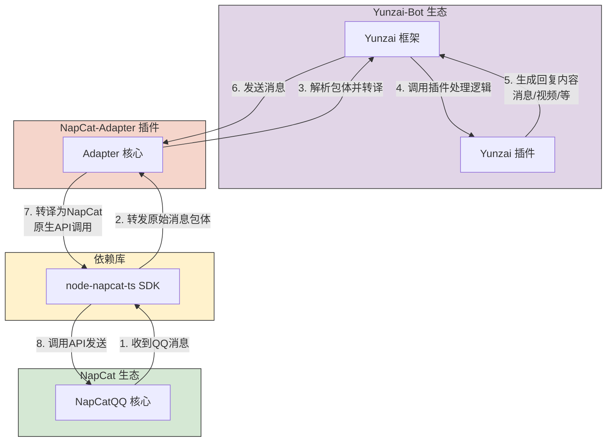

# 介绍

## Napcat-Adapter是怎么诞生的

在 ICQQ 公共签名服务遭受到不可抗力量干扰而被迫关闭的背景下，开发者意识到，“签名”若不握在自己手上，随时都会被一键拉闸。因此，开发者排除了Lgr，又因LiteLoader几乎完全无法使用而排除llonebot，而 NapCatQQ 以其出色的易用性和便捷的部署方式进入了开发者视野。其开放的 API 设计降低了开发门槛，吸引了大量开发者尝试使用，并催生了许多针对 NapCatQQ 的适配器项目。

但，在实际对接中，开发者发现，NapCatQQ在某些方面并不符合OneBotv11标准，造成大部分基于OneBotv11协议开发的Yunzai适配器插件对NapCatQQ的兼容性很差。

为了解决这一痛点，NapCat-Adapter 应运而生。它作为专门的协议适配层，致力于弥合 Yunzai-V3 与 NapCat 之间的技术鸿沟，通过协议转换和功能桥接，使 Yunzai-V3 能够无缝对接 NapCat 平台，彻底解决了二者之间的兼容性问题。

在这里，感谢Lain-plugin，为了减少开发初期的工作量，有相当一部分代码是直接从Lain-plugin中Copy出来的。

 

## 为什么要用 Napcat-Adapter？

~~因为它柔~~ 首先来看

### 对于 Yunzai 各种分支的兼容性（标 * 代表可能存在不兼容）

|       Yunzai 版本           | 兼容情况 |
| --------------------------- | ------- |
| Miao-Yunzai（推荐使用）      |   ✅   |
| TRSS-Yunzai                 |   ✅   |
| Yunzai-Next                 |   ✅   |
| 理论上支持 V3 插件的 Yunzai  |  ✅ \*  |

### 功能支持 （标 * 代表可能存在不适用）

| 功能                                 | 支持情况 |
| ------------------------------------ | ------- |
| 收发消息                              | ✅    |
| 戳一戳                                | ✅    |
| 合并转发、嵌套转发                     | ✅    |
| 图片、图文混排                        | ✅    |
| 语音、视频                           | ✅    |
| 文件相关 <a href="/qa/file">💡</a>    | ✅ \* |
| 椰奶发表说说、公告等 API 操作          | ✅    |
| 发音乐卡片、资料卡点赞等               | ✅    |
| 事件接受                             | ✅ \* |

### 画饼

 
 
- [ ] 更好的支持发送文件
- [ ] 和 Napcat 共存，直接获得更好的体验
- [ ] 一个神秘东西？

似乎好像解决了下面这个上面的所有都可以解决了呢
- [ ] 内置轻量版 Napcat ，获得和 icqq 一般的体验

## Napcat-Adapter 是怎么工作的？

请看流程图

 

## 快来使用 Napcat-Adapter 吧！

 

[出发！](/install)
